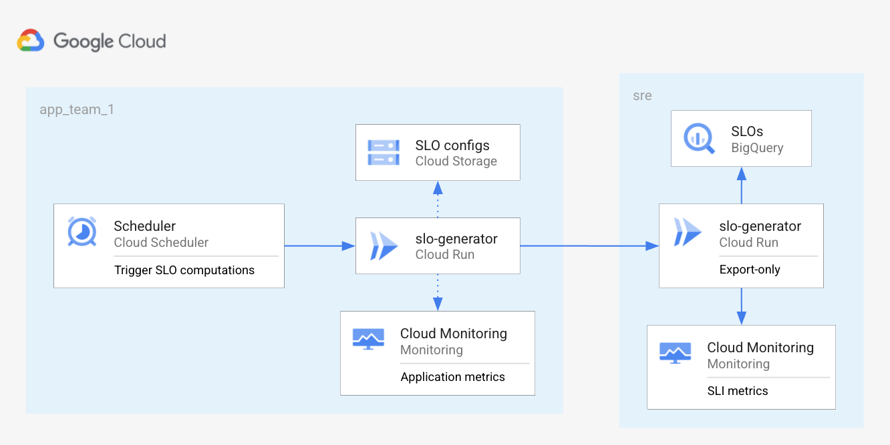

# terraform-google-slo

## Native SLOs (Service Monitoring API)
The [`slo-native`](./modules/slo-native) submodule deploys SLOs to Google Cloud Service Monitoring API. It uses the native Terraform resource [`google_monitoring_slo`](https://www.terraform.io/docs/providers/google/r/monitoring_slo.html) to achieve this.

**Use this module if:**
- Your SLOs will use metrics from Cloud Monitoring backend **only**, not other backends.

- You want to use the Service Monitoring UI to monitor your SLOs.

### Usage
Deploy your SLO directly to the Service Monitoring API:

#### HCL format
```hcl
module "slo_basic" {
  source = "terraform-google-modules/slo/google//modules/slo-native"
  config = {
    project_id        = var.app_engine_project_id
    service           = data.google_monitoring_app_engine_service.default.service_id
    slo_id            = "gae-slo"
    display_name      = "90% of App Engine default service HTTP response latencies < 500ms over a day"
    goal              = 0.9
    calendar_period   = "DAY"
    type              = "basic_sli"
    method            = "latency"
    latency_threshold = "0.5s"
  }
}
```
See [`examples/native/simple_example`](./examples/native/simple_example) for another example.

#### YAML format
You can also write an SLO in a YAML definition file and load it into the module:
```
locals {
  config = yamldecode(file("configs/my_slo_config.yaml"))
}

module "slo_basic" {
  source = "terraform-google-modules/slo/google//modules/slo-native"
  config = local.config
}
```
A standard SRE practice is to write SLO definitions as YAML files, and follow DRY principles. See [`examples/slo-generator/yaml_example`](./examples/native/yaml_example) for an example of how to write re-usable YAML templates loaded into Terraform.

## SLO generator (any monitoring backend)
The [`slo-generator`](./modules/slo-generator) module deploys the [`slo-generator`](https://github.com/google/slo-generator/blob/master/README.md)
in Cloud Run in order to compute and export SLOs on a schedule.

SLO Configurations are pushed to Google Cloud Storage, and schedules are maintained using Google Cloud Schedulers.

**Use this setup if:**
- You are using other metrics backends than Cloud Monitoring that you want to create SLOs out of (e.g: Elastic, Datadog, Prometheus, ...).

- You want to have custom reporting and exporting for your SLO data, along with historical data (e.g: BigQuery, DataStudio, custom metrics).

- You want to have a common configuration format for all SLOs (see [documentation](https://github.com/google/slo-generator/README.md)).

### Architecture



### Compatibility
This module is meant for use with Terraform 0.13. If you haven't
[upgraded](https://www.terraform.io/upgrade-guides/0-13.html) and need a Terraform
0.12.x-compatible version of this module, the last released version
intended for Terraform 0.12.x is [v1.0.2](https://registry.terraform.io/modules/terraform-google-modules/-slo/google/v1.0.2).

### Usage

Deploy the SLO generator service with some SLO configs:

```hcl
locals {
  config = yamldecode(file("templates/config.yaml"))
  slo_configs = [
    for cfg in fileset(path.module, "/templates/slo_*.yaml") :
    yamldecode(file(cfg))
  ]
}

module "slo-generator" {
  source = "terraform-google-modules/slo/google//modules/slo-generator"
  project_id  = "<PROJECT_ID>"
  config      = local.config
  slo_configs = local.slo_configs
}
```

For information on the config formats, lease refer to the `slo-generator` documentation:
* [slo-generator config](https://github.com/google/slo-generator#shared-configuration)
* [SLO config](https://github.com/google/slo-generator#slo-configuration)

See [`examples/slo-generator/simple_example`](./examples/slo-generator/simple_example) for a complete example.

See [`examples/slo-generator/sre_service_advanced`](./examples/slo-generator/sre_service_advanced) for a real-world organizational example, where the application teams deploy their SLOs using the `slo-generator` service deployed by an SRE team.

## Contributing

Refer to the [contribution guidelines](./CONTRIBUTING.md) for
information on contributing to this module.

[terraform-provider-gcp]: https://www.terraform.io/docs/providers/google/index.html
[terraform]: https://www.terraform.io/downloads.html
